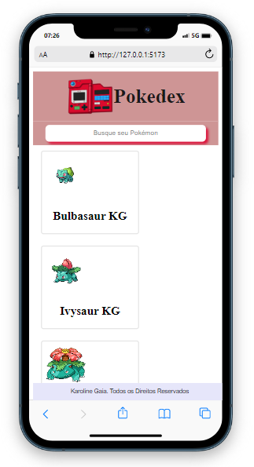
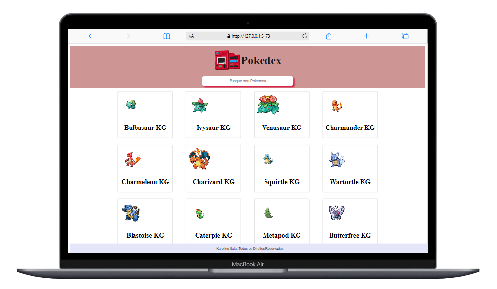

<a id='ancora'></a>
# Projeto Pokedex - CopyBase 🚀

<br>

<p align="center">
    
</p>

<br><br>

- [Sobre a CopyBase](#ancora1) <br>
- [Sobre o Projeto](#ancora2) <br>
- [Competências Desenvolvidas](#ancora3) <br>
- [Melhorias / Evolução futura do projeto](#ancora4) <br>
- [Execução](#ancora5) <br>
- [Prints de Execução](#ancora6) <br>
- [Desenvolvedora](#ancora7)

<br><br>


<a id="ancora1"></a>
## Sobre a CopyBase

<br>

<p align="center">
    
</p>

<br>

A Copybase é um assistente de escrita automatizada com Inteligência Artificial que ajuda você a criar textos, copys e anúncios incríveis, em apenas alguns segundos!

<br>

<a id="ancora2"></a>
## Sobre o Projeto ✔️

<br>

Você irá construir uma aplicação para listagem e busca de pokemons. É uma aplicação simples, onde iremos buscar por um determinado pokémon, pelo seu nome, para termos acesso às suas propriedades requisitadas através da PokeAPI v2.


Nossa ideia de interface é uma tela com apenas um campo de busca no centro da tela, que ao ser acionado com o nome do pokémon, irá submeter esta pesquisa para a PokeAPI, retornando as informações do pokémon buscado e de suas evoluções (Evolution Chains).


Para cada um dos pokémons listados (o pesquisado e suas evoluções), gostaríamos de ver seu nome e sua imagem.


Quando clicarmos em um pokémon listado, queremos listar suas principais características (hp, attack, defense, special attack, special defense e speed). Obviamente quanto mais informações você mostrar melhor (organizadas, usando princípios básicos de UI/UX), então fique a vontade para exibir o que mais achar interessante.

<br>

<a id="ancora3"></a>
## Competências Desenvolvidas 📝

<br>

* JavaScript;
* VueJs;
* SASS;
* Axios;
* Vite;
* Vuetify
* Style Components;
* Arquitetura separada por Diretórios;
* Consumo de API;
* Git Flow;


<br>

<a id="ancora4"></a>
## Melhorias / Evolução futura do projeto 📋

<br>

1. Ocultar todos os pokémons da página de busca. ✔️
<br><br>
2. Buscar mais informações da pokeAPI. ✔️
<br><br>
3. Inserção de Foto. ✔️
<br><br>
4. Criação do Modal para exposição de detalhes do pokémon. ✔️

<br>

<a id="ancora5"></a>
## Execução 💻

<br>

1. Clone este repositório remoto em seu equipamento:
```
git clone https://github.com/Karolinegaia/CopyBase-challenge.git
```
2. Execute o comando para instalação dos node_modules:
```
npm install
```
3. Execute o programa:
```
npm run dev
```

<br>

<a id="ancora6"></a>
## Prints de Execução 📷

<br>

<p align="center">
    
</p>

<br>

<p align="center">
    
</p>

<br>


<a id="ancora7"></a>
## Desenvolvedora 🤝

Projeto desenvolvido por:

<table>
  <tr>
    <td align="center">
      <a target="_blank" href="https://www.linkedin.com/in/karoline-gaia-alexandre/">
        <br>
        <sub>
          <b>Karoline Gaia</b>
           <p>Front-end Dev</p>
        </sub>
      </a>
    </td>
  </tr>
</table>

<br><br>

[Voltar ao Topo](#ancora)